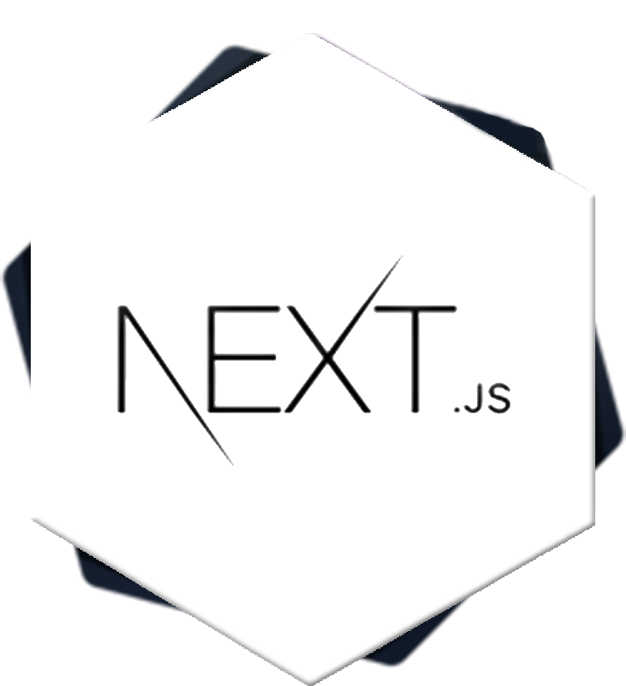

<a href="https://arthurvasconcellos.com/" target="_blank">
  

    
  

  

    
  

</a>

## About

Senior Software Engineer with 7 years of experience, I specialize in creating web applications that are straightforward and effective, particularly within the healthcare and fintech sectors. Having worked in both startups and large corporations, I am committed to leveraging technology to solve real-world challenges.

 🔧 Skills:

- JavaScript · React.js · Next.js · Lit · TypeScript
- AWS · Docker · Kubernetes · MySQL · MongoDB
- Node.js · Web Components · Microservices
- Unit, Integration and E2E Testing · TDD
- HTML5 · CSS3 · SASS · Webpack · Gulp

 📚 Education:

- Bachelor's Degree in Computer Science [2018-2023]
- Postgraduate Degree in Software Architecture [2023-2024]

 🌱 I’m all about using the latest tech to improve products and user experiences. I love teaming up with people who are passionate about making a difference through innovation.

## Main Tech Stack

 
 

## Other skills

 
  
